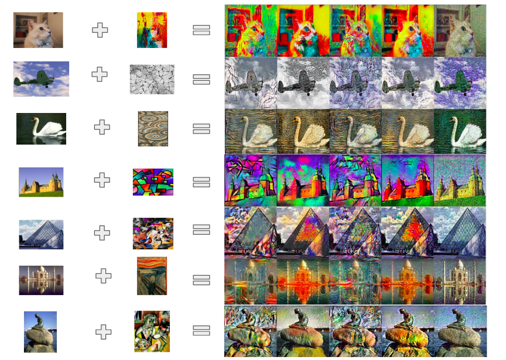
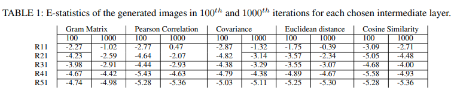

## Deep Correlation Multimodal Style Transfer

An implementation of the [Deep Correlation Multimodal Style Transfer (DerCorMST)](https://ieeexplore.ieee.org/stamp/stamp.jsp?tp=&arnumber=9570351&fbclid=IwAR3BG6HEA3lReyvBvnLOeJBBxhke-Zu6jx0zDrF4GOcjJ3TVGrF5vzb9-9o).
Deep Correlation Multimodal Style Transfer (DeCorMST) is a neural style transfer network that produces multiple generated outputs from a single pair of content and style images.

This repo will provides our implementation in [One2ManyNeuralStyleTransfer.ipynb](One2Many%20NeuralStyleTransfer.ipynb)
based on [the tutorials from Tensorflow](https://www.tensorflow.org/tutorials/generative/style_transfer). Besides the use of Gram
Matrix to extract style of images as in the tutorial and [the original paper](https://arxiv.org/abs/1508.06576), we developed and investigate of four 
other different correlations and similarity formulas to proposed an end-to-end architecture generating multimodal style transfer outputs based on 
each correlations.

Here is some example results:



## Evaluation
Based on each output from DeCorMST, we evaluate them according two criteria, which are preserving content and style adaptation,
so-called **C-statistics** and **E-statistics** from [Improving Style Transfer with Calibrated Metrics](https://openaccess.thecvf.com/content_WACV_2020/papers/Yeh_Improving_Style_Transfer_with_Calibrated_Metrics_WACV_2020_paper.pdf) [1]

### E-statistics
To evaluate the style adaptation ability, we reproduce the method that the authors in [1] used, which calculated the negative log KL distance between 
the generated output and the style image. See details in [1].
The generate the E-statistics, please run the [Quantitative_Style_Transfer.ipynb](Quantative_Style/Baed_E_scripts/Quantative_Style_Transfer.ipynb)

The related files and folders from E-statistic quantitative:
1. Reference_dir is the set of content images for finding PCA basis,  Reference_dir =`./content/`
2. your input images are listed in `./input.txt` file and located in source_dir (example as `./sample/`)
3. your output file stores your evaluation `EValuation.txt`

The output file will contain 5 columns ("Name", "E1", "E2", "E3", "E4", "E5"), which are name of image, and 5 intermediate
layers you used. In our case, they are 'block1_conv1', 'block2_conv1', 'block3_conv1', 'block4_conv1', 'block5_conv1' of VGG

Here is our evaluation:


### C-statistics
A contour detection method of estimating the probability of object boundaries (Pb) in given image. We wish the generated image
will preserve as many boundaries as it can.
The code is using MATLAB. 
1. Please download the test images and their ground truth contour annoations from the [BSDS500 dataset](https://www.dropbox.com/s/nflmpwisbpr1ebw/BSDS500.zip?dl=0). Unzip downloaded file as "./BSDS500" under the [Quantative_Style](./Quantative_Style) folder.
2. run `single_evaluation.mlx` in MATLAB Online (live script) where the information of your images are listed in `wcs3.txt`.
```
# Example of wcs3.txt
1 123057 1 100 #style_1_sontent_123057_gramMatrix_iteration_100
1 123057 2 100 #style_1_sontent_123057_Pearson_iteration_100
1 123057 3 100 #style_1_sontent_123057_Covariance_iteration_100
1 123057 4 100 #style_1_sontent_123057_Euclidean_iteration_100
1 123057 5 100 ##style_1_sontent_123057_CosineSimilarity_iteration_100

```
3. retreive evaluation results from `./BSDS500/ucm2/SampleTests/Universal` folder.


